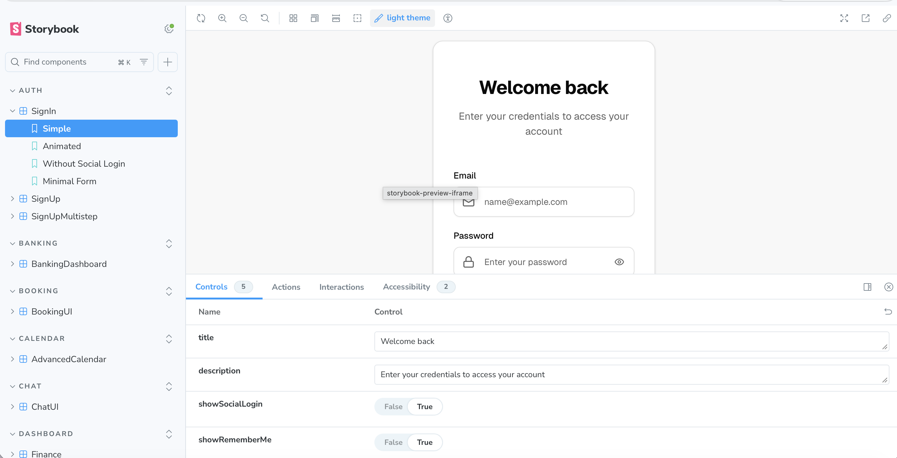
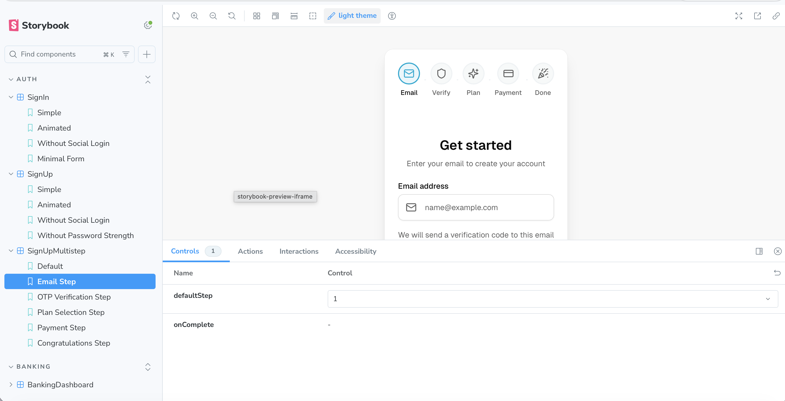
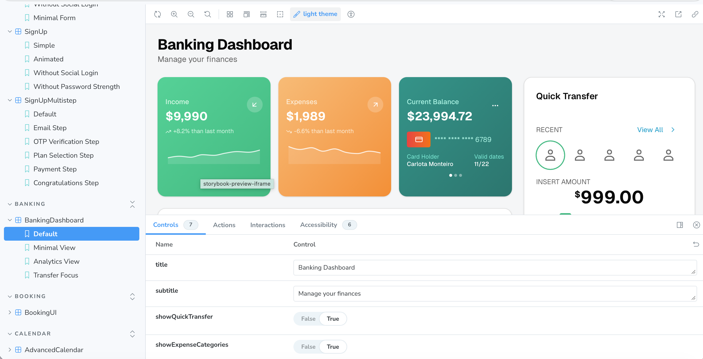
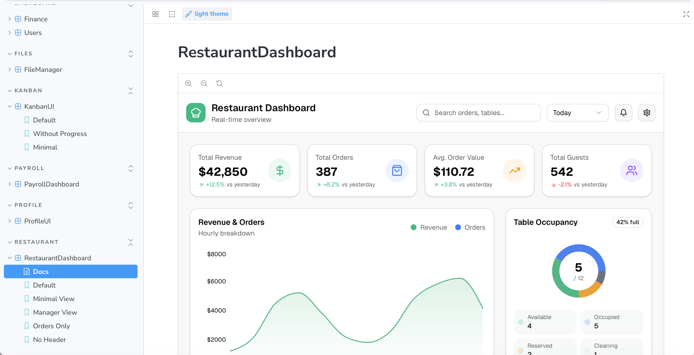
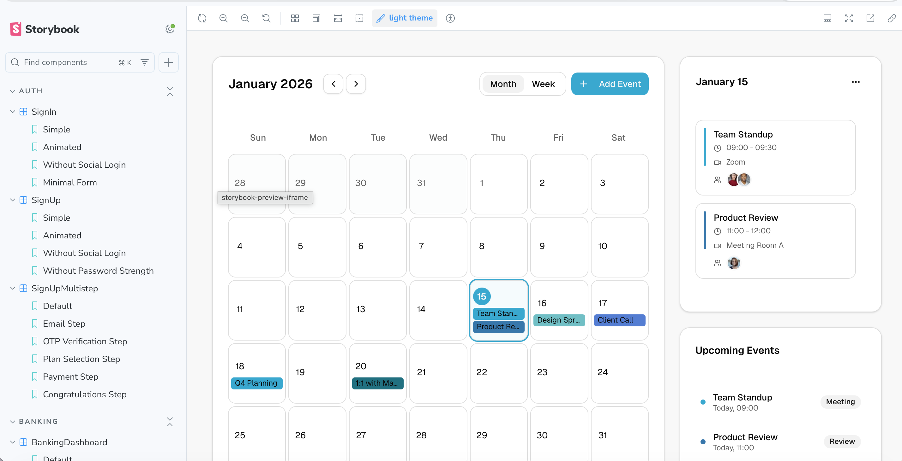
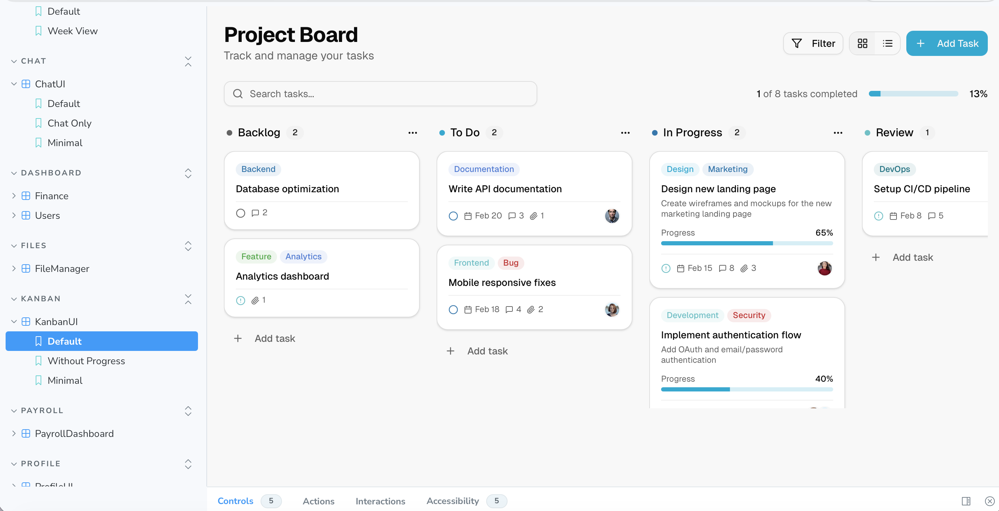
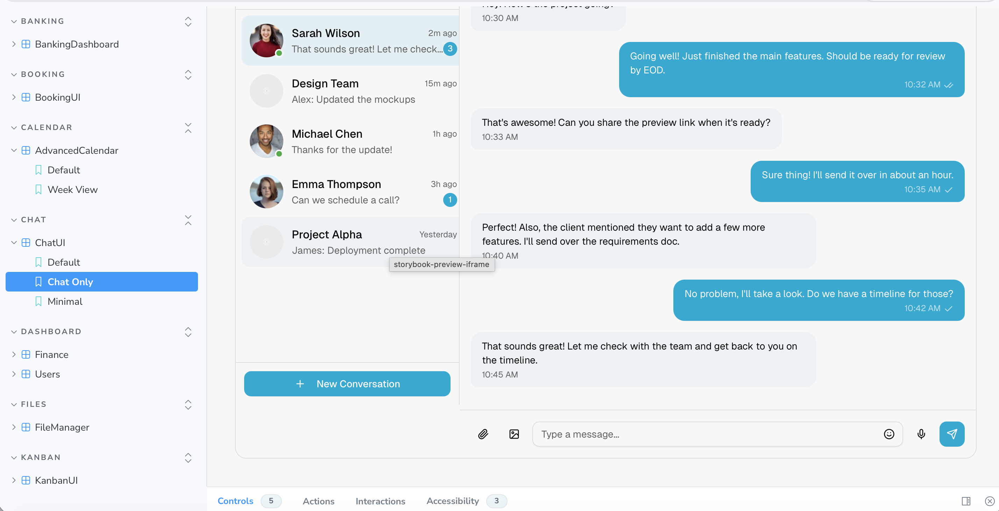
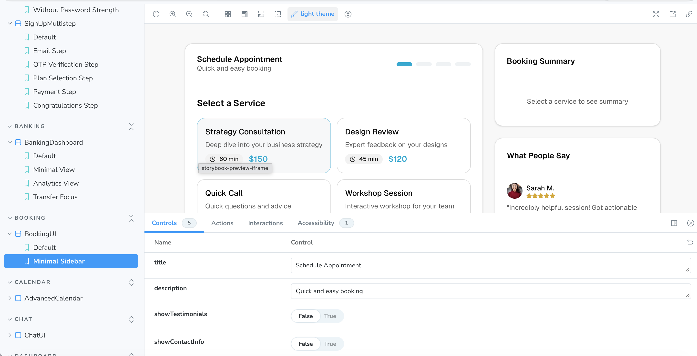

# lib-components

A comprehensive, production-ready UI component library built entirely with **Vercel v0**. Features a Next.js demo app and Storybook for isolated component development and testing.

## Showcase

### Authentication Components



### Dashboard Components



### Application Components





---

## Components

### Authentication (5 components)

| Component | Description | Features |
|-----------|-------------|----------|
| **SignIn Simple** | Clean login form | Email/password, social login, remember me |
| **SignIn Animated** | Animated login with transitions | Smooth animations, social providers |
| **SignUp Simple** | Basic registration form | Name, email, password with strength indicator |
| **SignUp Animated** | Animated registration | Transitions, password validation |
| **SignUp Multistep** | 5-step onboarding wizard | Email, OTP verification, plan selection, payment, confirmation |

### Dashboards (5 components)

| Component | Description | Features |
|-----------|-------------|----------|
| **Finance Dashboard** | Financial overview | Revenue charts, expense tracking, transaction history |
| **Users Dashboard** | User management | User table, filters, statistics, bulk actions |
| **Banking Dashboard** | Personal banking | Income/expenses cards, balance, quick transfers, card carousel |
| **Payroll Dashboard** | Employee payroll | Salary overview, payment history, tax summaries |
| **Restaurant Dashboard** | Restaurant management | Revenue analytics, table occupancy, live orders, staff overview |

### Productivity (4 components)

| Component | Description | Features |
|-----------|-------------|----------|
| **Advanced Calendar** | Event management | Month/week views, event details, upcoming events sidebar |
| **Kanban Board** | Project management | Drag-ready columns, task cards, progress tracking, filters |
| **Chat UI** | Messaging interface | Conversation list, real-time messages, attachments, emoji |
| **Support UI** | Customer support | Ticket management, priority levels, response templates |

### Business Tools (4 components)

| Component | Description | Features |
|-----------|-------------|----------|
| **Booking UI** | Appointment scheduling | Service selection, date/time picker, booking summary |
| **Wallet UI** | Digital wallet | Balance display, transaction history, send/receive |
| **File Manager** | Cloud file management | Multi-cloud integration, folders, recent files, storage usage |
| **Profile UI** | User profile | Avatar, personal info, settings, activity history |

---

## Tech Stack

- **Framework:** Next.js 15 (App Router)
- **Styling:** Tailwind CSS v4
- **Components:** shadcn/ui
- **Charts:** Recharts
- **Icons:** Lucide React
- **Documentation:** Storybook 8

---

## Getting Started

### Installation

### Clone the repository
```bash
git clone https://github.com/your-username/lib-components.git
cd lib-components
```

### Install dependencies
```bash
pnpm install
```

### Start development server
```bash
pnpm dev
```

### Storybook


### Start Storybook for component development
```bash
pnpm storybook
```

Then open `http://localhost:6006` in your browser.

---

## Project Structure

```bash
lib-components/
├── app/                    # Next.js app directory
│   ├── page.tsx           # Component preview gallery
│   ├── layout.tsx         # Root layout
│   └── globals.css        # Global styles & design tokens
├── components/
│   ├── auth/              # Authentication components
│   ├── banking/           # Banking dashboard
│   ├── booking/           # Booking/scheduling UI
│   ├── calendar/          # Calendar component
│   ├── chat/              # Chat interface
│   ├── dashboard/         # Finance & Users dashboards
│   ├── files/             # File manager
│   ├── kanban/            # Kanban board
│   ├── payroll/           # Payroll dashboard
│   ├── profile/           # User profile
│   ├── restaurant/        # Restaurant dashboard
│   ├── support/           # Customer support
│   ├── wallet/            # Digital wallet
│   └── ui/                # Base shadcn/ui components
├── stories/               # Storybook stories
└── .storybook/            # Storybook configuration
```

---

## Component Props

All components are fully configurable via props. Each component supports:

- **Customizable titles and descriptions**
- **Show/hide sections** (e.g., `showHeader`, `showSidebar`)
- **Configurable data** via props
- **Event callbacks** (e.g., `onSubmit`, `onSelect`)

Example:
```tsx
<BankingDashboard
  title="My Finances"
  subtitle="Track your spending"
  showQuickTransfer={true}
  showExpenseCategories={true}
/>
```

---

## License

MIT License - feel free to use these components in your projects.

---

Built with Vercel v0
